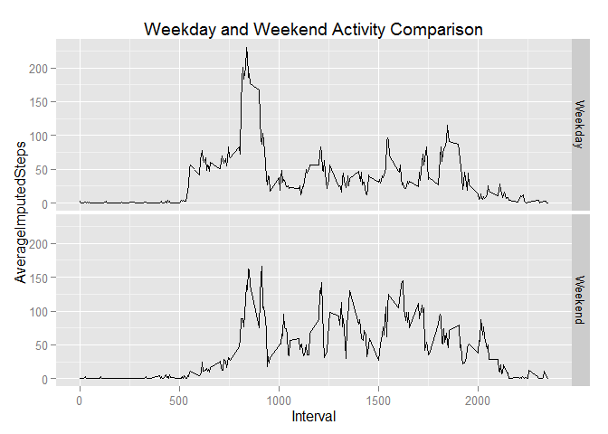

# Reproducible Research: Peer Assessment 1

Note: Full project instructions were copied in this file for documentation and 
ease of completing the assignment.  Throughout the report, all code generating 
output is included.

## Loading and preprocessing the data
Required packages (from the wonderful Hadleyverse)

```r
library(readr)
library(dplyr)
library(knitr)
library(ggplot2)
```
1. Load the data
2. Process/transform the data into a format suitable for analysis 

```r
Data <- tbl_df(read_csv("activity.zip",
                        skip=1,
                        col_names=c("Steps","Date","Interval"),
                        col_types=list(col_integer(),col_date(),col_integer())))

#verifed data was loaded as expected and reviewed its format
#no further processing needed at this point
str(Data);summary(Data);Data
```

```
## Classes 'tbl_df', 'tbl' and 'data.frame':	17568 obs. of  3 variables:
##  $ Steps   : int  NA NA NA NA NA NA NA NA NA NA ...
##  $ Date    : Date, format: "2012-10-01" "2012-10-01" ...
##  $ Interval: int  0 5 10 15 20 25 30 35 40 45 ...
```

```
##      Steps             Date               Interval     
##  Min.   :  0.00   Min.   :2012-10-01   Min.   :   0.0  
##  1st Qu.:  0.00   1st Qu.:2012-10-16   1st Qu.: 588.8  
##  Median :  0.00   Median :2012-10-31   Median :1177.5  
##  Mean   : 37.38   Mean   :2012-10-31   Mean   :1177.5  
##  3rd Qu.: 12.00   3rd Qu.:2012-11-15   3rd Qu.:1766.2  
##  Max.   :806.00   Max.   :2012-11-30   Max.   :2355.0  
##  NA's   :2304
```

```
## Source: local data frame [17,568 x 3]
## 
##    Steps       Date Interval
## 1     NA 2012-10-01        0
## 2     NA 2012-10-01        5
## 3     NA 2012-10-01       10
## 4     NA 2012-10-01       15
## 5     NA 2012-10-01       20
## 6     NA 2012-10-01       25
## 7     NA 2012-10-01       30
## 8     NA 2012-10-01       35
## 9     NA 2012-10-01       40
## 10    NA 2012-10-01       45
## ..   ...        ...      ...
```


## What is mean total number of steps taken per day?
For this part of the assignment, ignore the missing values in the dataset  

1. Calculate the total number of steps taken per day
<style type="text/css"> .table { width: 50%; } </style>

```r
DaySteps <- Data %>% 
                filter(!is.na(Steps)) %>% 
                group_by(Date) %>% 
                summarize(TotalSteps=sum(Steps))
kable(DaySteps)
```


Date          TotalSteps
-----------  -----------
2012-10-02           126
2012-10-03         11352
2012-10-04         12116
2012-10-05         13294
2012-10-06         15420
2012-10-07         11015
2012-10-09         12811
2012-10-10          9900
2012-10-11         10304
2012-10-12         17382
2012-10-13         12426
2012-10-14         15098
2012-10-15         10139
2012-10-16         15084
2012-10-17         13452
2012-10-18         10056
2012-10-19         11829
2012-10-20         10395
2012-10-21          8821
2012-10-22         13460
2012-10-23          8918
2012-10-24          8355
2012-10-25          2492
2012-10-26          6778
2012-10-27         10119
2012-10-28         11458
2012-10-29          5018
2012-10-30          9819
2012-10-31         15414
2012-11-02         10600
2012-11-03         10571
2012-11-05         10439
2012-11-06          8334
2012-11-07         12883
2012-11-08          3219
2012-11-11         12608
2012-11-12         10765
2012-11-13          7336
2012-11-15            41
2012-11-16          5441
2012-11-17         14339
2012-11-18         15110
2012-11-19          8841
2012-11-20          4472
2012-11-21         12787
2012-11-22         20427
2012-11-23         21194
2012-11-24         14478
2012-11-25         11834
2012-11-26         11162
2012-11-27         13646
2012-11-28         10183
2012-11-29          7047

2. Make a histogram of the total number of steps taken each day

```r
StepHistogram <- ggplot(DaySteps, aes(x=TotalSteps)) + 
                    geom_histogram() +
                    geom_vline(aes(xintercept=mean(TotalSteps))
                               ,color="blue"
                               ,size=2) +
                    geom_vline(aes(xintercept=median(TotalSteps))
                               ,color="orange"
                               ,size=2
                               ,linetype="dashed") +
                    ggtitle("Histogram of Total Steps Taken Each Day
(with blue line showing the mean and dashed orange line shown the median)")
StepHistogram
```

 

3. Calculate and report the mean and median of the total number of steps
taken per day

```r
mean(DaySteps$TotalSteps);median(DaySteps$TotalSteps)
```

```
## [1] 10766.19
```

```
## [1] 10765
```

## What is the average daily activity pattern?
1. Make a time series plot (i.e., type="l") of the 5-minute interval (x-axis) 
and the average number of steps taken, averaged across all days (y-axis)

```r
MeanSteps <- Data %>%
                filter(!is.na(Steps)) %>%
                group_by(Interval) %>%
                summarize(AverageSteps=mean(Steps))
qplot(Interval,AverageSteps,data=MeanSteps,geom="line")
```

 

2. Which 5-minute interval, on average across all the days in the dataset, 
contains the maximum number of steps?

```r
kable(MeanSteps %>%
        arrange(desc(AverageSteps),Interval) %>%
        top_n(1))
```


 Interval   AverageSteps
---------  -------------
      835       206.1698


## Imputing missing values
Note that there are a number of days/intervals where there are missing values 
(coded as NA). The presence of missing days may introduce bias into some 
calculations or summaries of the data.  

1. Calculate and report the total number of missing values in the dataset 
(i.e. the total number of rows with NAs)

```r
MissingByDate <- Data %>%
                    filter(is.na(Steps)) %>%
                    group_by(Date) %>% 
                    summarize(MissingCount=n())
#288 missing intervals equals one day (288*5=1440; 1440/60=24)
#8 days have all their Step values missing
kable(MissingByDate)
```


Date          MissingCount
-----------  -------------
2012-10-01             288
2012-10-08             288
2012-11-01             288
2012-11-04             288
2012-11-09             288
2012-11-10             288
2012-11-14             288
2012-11-30             288

```r
#total number of rows with NAs
sum(MissingByDate$MissingCount)
```

```
## [1] 2304
```

2. Devise a strategy for filling in all of the missing values in the dataset. 
The strategy does not need to be sophisticated. For example, you could use the 
mean/median for that day, or the mean for that 5-minute interval, etc.
3. Create a new dataset that is equal to the original dataset but with the 
missing data filled in.

```r
#For the imputation strategy, decided to use the mean for the 5-minute interval
#Mainly chosen because entire days were missing values
ImputedData <- inner_join(Data,MeanSteps,by="Interval") %>%
                mutate(ImputedSteps=ifelse(is.na(Steps),AverageSteps,Steps))
kable(ImputedData[c(1:5,646:651),]) #sample of new dataset
```


 Steps  Date          Interval   AverageSteps   ImputedSteps
------  -----------  ---------  -------------  -------------
    NA  2012-10-01           0      1.7169811      1.7169811
    NA  2012-10-01           5      0.3396226      0.3396226
    NA  2012-10-01          10      0.1320755      0.1320755
    NA  2012-10-01          15      0.1509434      0.1509434
    NA  2012-10-01          20      0.0754717      0.0754717
     0  2012-10-03         545     18.3396226      0.0000000
    90  2012-10-03         550     39.4528302     90.0000000
   411  2012-10-03         555     44.4905660    411.0000000
   413  2012-10-03         600     31.4905660    413.0000000
   415  2012-10-03         605     49.2641509    415.0000000
   519  2012-10-03         610     53.7735849    519.0000000

4. Make a histogram of the total number of steps taken each day. Calculate 
and report the mean and median total number of steps taken per day. Do these 
values differ from the estimates from the first part of the assignment? 
What is the impact of imputing missing data on the estimates of the total 
daily number of steps?

```r
DayStepsImp <- ImputedData %>% 
                        group_by(Date) %>% 
                        summarize(TotalImputedSteps=sum(ImputedSteps))

StepHistogramImp <- ggplot(DayStepsImp, aes(x=TotalImputedSteps)) + 
                        geom_histogram() +
                        geom_vline(aes(xintercept=mean(TotalImputedSteps))
                                   ,color="blue"
                                   ,size=2) +
                        geom_vline(aes(xintercept=median(TotalImputedSteps))
                                   ,color="orange"
                                   ,size=2
                                   ,linetype="dashed") +
                        ggtitle("Histogram of Total Imputed Steps Taken Each Day
(with blue line showing the mean & dashed orange line shown the median)")
StepHistogramImp
```

 

```r
#The imputed missing values have no impact on the mean
#The medians do differ, with the imputed being slighly larger
OrigDataStats <- data.frame(DataType="Original"
                            ,MeanSteps=mean(DaySteps$TotalSteps)
                            ,MedianSteps=median(DaySteps$TotalSteps))
ImpDataStats <- data.frame(DataType="Imputed"
                            ,MeanSteps=mean(DayStepsImp$TotalImputedSteps)
                            ,MedianSteps=median(DayStepsImp$TotalImputedSteps))
kable(bind_rows(OrigDataStats,ImpDataStats))
```


DataType    MeanSteps   MedianSteps
---------  ----------  ------------
Original     10766.19      10765.00
Imputed      10766.19      10766.19


## Are there differences in activity patterns between weekdays and weekends?
For this part the weekdays() function may be of some help here. 
Use the dataset with the filled-in missing values for this part.

1. Create a new factor variable in the dataset with two levels - "weekday" 
and "weekend" indicating whether a given date is a weekday or weekend day.

```r
ImputedData <- ImputedData %>%
                mutate(DayType=as.factor(ifelse(weekdays(ImputedData$Date)
                                                %in% c("Sunday","Saturday"),
                                                "Weekend","Weekday")))
kable(ImputedData[c(1,2001),c("Date","DayType")]) #sample to see new variable
```


Date         DayType 
-----------  --------
2012-10-01   Weekday 
2012-10-07   Weekend 

2. Make a panel plot containing a time series plot (i.e. type = "l") of the 
5-minute interval (x-axis) and the average number of steps taken, averaged 
across all weekday days or weekend days (y-axis). See the README file in the 
GitHub repository to see an example of what this plot should look like using 
simulated data.

```r
MeanStepsImp <- ImputedData %>%
                    group_by(Interval,DayType) %>%
                    summarize(AverageImputedSteps=mean(ImputedSteps))
plot <- ggplot(MeanStepsImp,aes(Interval,AverageImputedSteps)) +
            geom_line() +
            facet_grid(DayType~.) +
            ggtitle("Weekday and Weekend Activity Comparison")
plot
```

 
